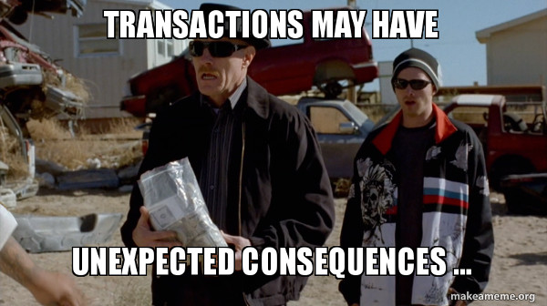
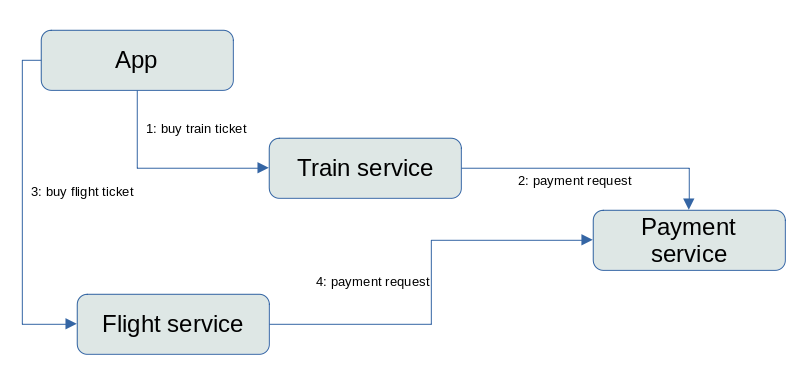
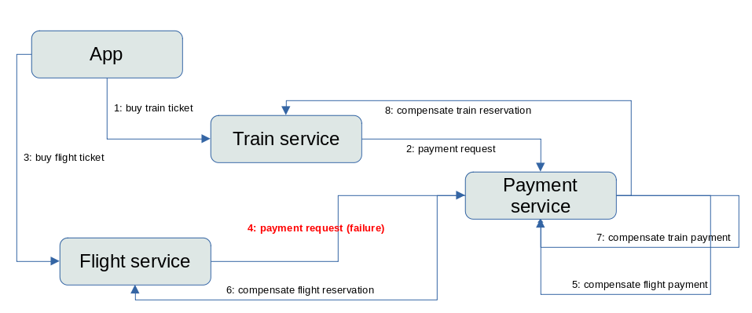
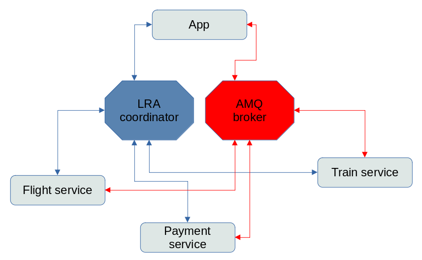
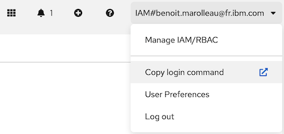
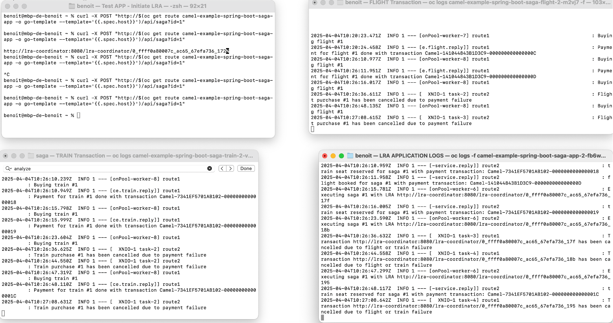

# Spring Boot and SAGA EIP Lab: Understanding the SAGA Pattern with Apache Camel
**Duration:** 25 minutes

## Overview

This example shows how to work with Apache Camel Saga using Spring Boot and Narayana LRA Coordinator to manage long running actions. Learn how the SAGA pattern handles distributed transactions across microservices using Long Running Actions (LRA) for compensation in case of failures.


---

## How it works

There are 4 services as participants of the Saga:

- **payment-service**: Emulates a real payment transaction and is used by both flight-service and train-service
- **flight-service**: Emulates the booking of a flight ticket and uses the payment-service to execute a payment transaction
- **train-service**: Emulates the reservation of a train seat and uses the payment-service to execute a payment transaction
- **app**: The starting point that emulates a user starting the transaction to buy both flight and train tickets

The starting point is a REST endpoint that creates a request for a new reservation with a **15% probability** that the payment service fails.

### Logical view



### Compensating a failure



### Technical view



The communication between services and LRA coordinator (blue connectors) is via HTTP protocol, so every service exposes REST endpoints called by the LRA, and it calls LRA via REST endpoint.

The communication between services (red connectors) is via AMQ broker (using OPENWIRE protocol), implemented using Camel JMS component and RequestReply EIP, obtaining a synchronous behavior using asynchronous protocol.


## Step 1: Cluster Login and Project Setup

Connect to your OpenShift cluster and create your project:



```bash
# Login to cluster (adapt with your credentials)
oc login --token=YOUR-TOKEN --server=https://c113-e.eu-de.containers.cloud.ibm.com:30516

# Create your project (use your team number)
oc new-project teamX
```

---

## Step 2: Build and Deploy the Application

Clone the repository and deploy the SAGA example:

```bash
git clone https://github.com/apache/camel-spring-boot-examples.git
cd camel-spring-boot-examples/saga
./install-ocp.sh
```

Wait for all pods to be ready (this may take 2-3 minutes).

---

## Step 3: Create Routes for External Access

Expose the services to make them accessible:

```bash
oc expose service camel-example-spring-boot-saga-app
oc expose service camel-example-spring-boot-saga-flight
oc expose service camel-example-spring-boot-saga-payment
oc expose service camel-example-spring-boot-saga-train
```

Verify routes are created:
```bash
oc get routes | grep camel-example-spring-boot-saga
```

---

## Step 4: Monitor Application Logs

Open **4 separate terminal windows** to monitor each service in real-time:

**Terminal 1 - Main App:**
```bash
oc logs -f $(oc get pods -l app.kubernetes.io/name=camel-example-spring-boot-saga-app -o name)
```

**Terminal 2 - Flight Service:**
```bash
oc logs -f $(oc get pods -l app.kubernetes.io/name=camel-example-spring-boot-saga-flight -o name)
```

**Terminal 3 - Train Service:**
```bash
oc logs -f $(oc get pods -l app.kubernetes.io/name=camel-example-spring-boot-saga-train -o name)
```

**Terminal 4 - Payment Service:**
```bash
oc logs -f $(oc get pods -l app.kubernetes.io/name=camel-example-spring-boot-saga-payment -o name)
```


---

## Step 5: Test SAGA with Random Payment Failures

The application simulates random payment failures to demonstrate compensation.

**Execute the SAGA transaction:**
```bash
curl -X POST "http://$(oc get route camel-example-spring-boot-saga-app -o go-template --template='{{.spec.host}}')/api/saga?id=1"
```

**Run this command multiple times (5-10 times)** and observe the different outcomes in your log terminals.

### What to Observe:

Each transaction follows this sequence:
1. **Train booking** is attempted first
2. **Flight booking** is attempted second
3. **Payment** is processed last

The payment service has a **random failure rate** built-in. Watch for these scenarios:

---

## Step 6: Understanding SAGA Compensation Patterns

### Scenario A: Train Payment Fails ❌
**Sequence:**
- Train booking: ✅ Reserved
- Train payment: ❌ **FAILS**
- LRA Status: **CANCELLED**

**Compensation:**
- Train reservation is **compensated** (cancelled)
- Flight is never attempted

**Log Pattern:**
```
Train: Reserving train...
Train: Payment failed!
LRA: Compensation triggered
Train: Cancelling train reservation...
```

---

### Scenario B: Flight Payment Fails ❌
**Sequence:**
- Train booking: ✅ Reserved
- Train payment: ✅ Success
- Flight booking: ✅ Reserved
- Flight payment: ❌ **FAILS**
- LRA Status: **CANCELLED**

**Compensation:**
- Flight reservation is **compensated** (cancelled)
- Train reservation is **compensated** (cancelled) - **This is the SAGA pattern in action!**

**Log Pattern:**
```
Train: Reserving train... SUCCESS
Train: Payment confirmed
Flight: Reserving flight... SUCCESS
Flight: Payment failed!
LRA: Compensation triggered
Flight: Cancelling flight reservation...
Train: Cancelling train reservation...  ← Rollback!
```

---

### Scenario C: All Payments Succeed ✅
**Sequence:**
- Train booking: ✅ Reserved
- Train payment: ✅ Success
- Flight booking: ✅ Reserved
- Flight payment: ✅ Success
- LRA Status: **COMPLETED**

**No Compensation Needed:**
- All bookings are confirmed
- Transaction is complete

**Log Pattern:**
```
Train: Reserving train... SUCCESS
Train: Payment confirmed
Flight: Reserving flight... SUCCESS
Flight: Payment confirmed
LRA: Transaction completed successfully
```

---

## Key Takeaways

1. **SAGA Pattern**: Manages distributed transactions without requiring distributed locks
2. **LRA (Long Running Actions)**: Coordinates compensation across services
3. **Compensation Logic**: Each service implements both forward and backward operations
4. **Eventual Consistency**: System reaches a consistent state through compensation, not rollback

---

## Optional: Adjust Failure Rate

To change the payment failure probability, examine and modify the payment service source code:

**View the source code:**
[`saga-payment-service/src/main/java/org/apache/camel/example/saga/PaymentRoute.java`](saga-payment-service/src/main/java/org/apache/camel/example/saga/PaymentRoute.java)

Look for the random threshold logic that determines payment success/failure rate.

**To rebuild and redeploy after modifications:**

1. **Build the payment service:**
   ```bash
   cd saga-payment-service
   mvn clean package -DskipTests
   cd ..
   ```

2. **Deploy only the payment service:**
   ```bash
   mvn oc:build oc:deploy -pl saga-payment-service
   ```

3. **Verify the new pod is running:**
   ```bash
   oc get pods -l app.kubernetes.io/name=camel-example-spring-boot-saga-payment -w
   ```

---

---

## 🎯 Bonus Exercise: LRA Coordinator (5 minutes)

**Challenge:** Become an LRA investigator and track the lifecycle of your distributed transactions!

### Mission Briefing

The LRA Coordinator is the "brain" that orchestrates all compensations. Let's spy on it to understand how it manages transaction states.

### Step 1: Access the LRA Coordinator

```bash
# Get the LRA Coordinator route
oc get route lra-coordinator

# Or create it if it doesn't exist
oc expose service lra-coordinator
```

### Step 2: Monitor Active LRAs

Open the LRA Coordinator dashboard in your browser:
```bash
echo "http://$(oc get route lra-coordinator -o go-template --template='{{.spec.host}}')"
```

### Step 3: Transaction Analysis

**Run this script to generate multiple transactions:**
```bash
for i in {1..10}; do
  echo "Transaction $i..."
  curl -X POST "http://$(oc get route camel-example-spring-boot-saga-app -o go-template --template='{{.spec.host}}')/api/saga?id=$i" &
  sleep 0.5
done
wait
```

**Your Mission:** Analyze the LRA Coordinator dashboard and determine how many transactions are in each state:
- ✅ Completed
- ❌ Cancelled
- ⏳ Active (still running)

Calculate the overall success rate and document your findings.

### Bonus Points 🌟

**Check the LRA Coordinator logs:**
```bash
oc logs -f $(oc get pods -l app=lra-coordinator -o name)
```

**Questions to explore:**
- How long does the coordinator keep transaction history?
- What happens if you restart the LRA Coordinator pod during a transaction?
- Can you find the LRA transaction IDs in the service logs?

### Pro Tip 💡

Each LRA has a unique ID. Try to match an LRA ID from the coordinator with the corresponding logs in your service terminals!

```bash
# Example: Search for a specific LRA ID in logs (replace with actual LRA ID from coordinator)
oc logs $(oc get pods -l app.kubernetes.io/name=camel-example-spring-boot-saga-train -o name) | grep "12345678-1234-1234-1234-123456789abc"
```

---

### Answers to Exploration Questions

**Q: How long does the coordinator keep transaction history?**

A: The LRA Coordinator keeps transaction history in memory by default. The retention depends on the coordinator's configuration, but typically:
- Completed transactions: Retained for a configurable period (default: until coordinator restart)
- Failed/Cancelled transactions: Retained longer for debugging purposes
- Active transactions: Kept until completion or timeout

For production systems, you should configure persistent storage or integrate with a monitoring solution to retain historical data beyond pod restarts.

**Q: What happens if you restart the LRA Coordinator pod during a transaction?**

A: When the LRA Coordinator pod restarts during an active transaction:
1. **Active LRAs are lost** - The coordinator loses in-memory state
2. **Services may be left in inconsistent states** - Participants don't receive compensation signals
3. **Timeout mechanisms activate** - Services should implement timeout logic to handle coordinator failures
4. **Manual intervention may be required** - You may need to manually compensate or rollback affected services

This demonstrates why production LRA Coordinators should use persistent storage and high availability configurations.

**Q: Can you find the LRA transaction IDs in the service logs?**

A: Yes! LRA transaction IDs appear in service logs when:
- A saga is initiated (look for "LRA started" or similar messages)
- Compensation is triggered (look for "Compensating" messages)
- The saga completes or fails

Example search commands:
```bash
# Search in the main app
oc logs $(oc get pods -l app.kubernetes.io/name=camel-example-spring-boot-saga-app -o name) | grep -i "lra"

# Search in flight service
oc logs $(oc get pods -l app.kubernetes.io/name=camel-example-spring-boot-saga-flight -o name) | grep -i "lra"

# Search in payment service
oc logs $(oc get pods -l app.kubernetes.io/name=camel-example-spring-boot-saga-payment -o name) | grep -i "lra"

# Search in train service
oc logs $(oc get pods -l app.kubernetes.io/name=camel-example-spring-boot-saga-train -o name) | grep -i "lra"
```

The LRA ID is a UUID that uniquely identifies each distributed transaction across all participating services.

---

**Time's up! Share your findings with the class 🎉**


## Cleanup

```bash
oc delete project teamX
```

---

## Credits 

Based on the [Camel SAGA example](https://github.com/apache/camel-spring-boot-examples/tree/main/saga)

## References

- Read the reference ! [The Saga Pattern in Apache Camel by Nicola Ferraro](https://www.nicolaferraro.me/2018/04/25/saga-pattern-in-apache-camel/)

- [Based on quickstart](https://github.com/nicolaferraro/camel-saga-quickstart)
- [Camel Saga EIP](https://camel.apache.org/components/latest/eips/saga-eip.html)
- [Narayana LRA project](https://www.narayana.io/lra/index.html)
- [Microprofile LRA specification](https://download.eclipse.org/microprofile/microprofile-lra-1.0/microprofile-lra-spec-1.0.html)
- [Camel JMS component](https://camel.apache.org/components/latest/jms-component.html)
- [Camel RequestReply EIP](https://camel.apache.org/components/latest/eips/requestReply-eip.html)

**End of Lab**


## Appendix

### Red Hat Developer Sandbox usage example

Go to https://developers.redhat.com/developer-sandbox/get-started after login, click on `Start using your sandbox` button.

Then login into the OpenShift and copy the command login clicking on the link `Copy Login Command` in the OpenShift console (the command will be something similar to `oc login --token=sha256~xxxx --server=https://api.sandbox-xxxx.openshiftapps.com:6443`).

Select your project `oc project xxxxxx-dev`

Run that command on the terminal and then run the installation script `./install-ocp-ephemeral.sh`


### Running on local environment

### Requirements

- `docker compose` installed ([guide](https://docs.docker.com/compose/install/))

### Run script to execute services locally

```bash
./run-local.sh
```

It will generate all the necessary Docker containers and java processes. Logs are stored in the `.log` files, and process IDs in the `.pid` files.

### Run script to stop services locally

```bash
./stop-local.sh
```

This command will kill the running processes, remove the PID files and stop the containers. The log files will be left.

### Analyzing logs

In the logs there will be all the messages about the execution of the service.

First the app starts the saga LRA, passing the id to the entry point REST:

```bash
# Local environment
curl -X POST http://localhost:8084/api/saga?id=1

# OpenShift cluster
curl -X POST "http://$(oc get route camel-example-spring-boot-saga-app -o go-template --template='{{.spec.host}}')/api/saga?id=1"
```

In the log:

```
Executing saga #1 with LRA http://localhost:8080/lra-coordinator/0_ffff7f000001_8aad_62d16f11_2
```

Where the URL contains the id of the LRA and the number of the saga is the value of the parameter passed to the REST in the starting point.

We're expecting that if the payment is ok, the message in the payment service will be:

```
Paying train for order #1

Payment train done for order #1 with payment transaction xxxxx

Payment flight done for order #1 with payment transaction xxxxx
```

The value of the payment transaction is the `JMSCorrelationID` used in the RequestReply EIP in the payment service.

If the random failure occurs, the log in the payment service will be:

```
Payment flight for saga #65 fails!

Payment for order #65 has been cancelled
```

It means that the compensation for the payment has been called, so we expect that in the flight service there will be a log:

```
Flight purchase #65 has been cancelled due to payment failure
```

In the train service:

```
Train purchase #65 has been cancelled due to payment failure
```

In the app:

```
Transaction http://localhost:8080/lra-coordinator/0_ffff7f000001_8aad_62d16f11_74 has been cancelled due to flight or train failure
```

---
